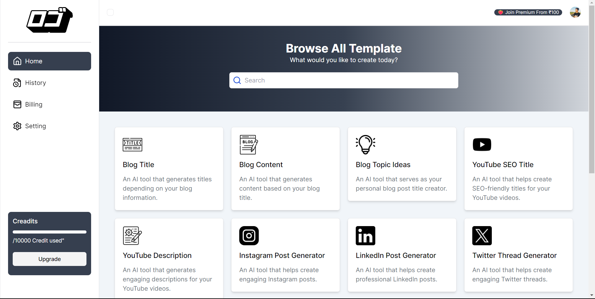

# WordSmith - AI-Powered Content Creation SaaS

[Project Link](https://wordsmith-gilt.vercel.app)

WordSmith is an AI-powered SaaS tool designed to help you create high-quality content effortlessly. Whether you need to generate social media threads, Instagram posts, blog articles, or LinkedIn updates, WordSmith streamlines the content creation process with cutting-edge AI technology.

## Features

- **Content Generation**: Create engaging threads, Instagram posts, blog articles, and LinkedIn updates.
- **User-Friendly Interface**: Intuitive design with seamless navigation.
- **AI-Powered Suggestions**: Get intelligent content recommendations and improvements.
- **Comprehensive Dashboard**: Manage your content and track your progress effectively.
- **Secure Login**: Robust user authentication and account management.
- **Billing and Settings**: Manage your subscription and customize app settings.

## Technologies Used

### Next.js
- **Description**: Framework for server-side rendering and static site generation with React.
- **Usage**: Powers the frontend of WordSmith for a fast and dynamic user experience.

### Tailwind CSS
- **Description**: Utility-first CSS framework for creating custom designs.
- **Usage**: Provides styling for a responsive and visually appealing interface.

### TypeScript
- **Description**: Superset of JavaScript that adds static typing.
- **Usage**: Enhances code quality and maintainability.

### Gemini
- **Description**: AI tool for generating and enhancing content.
- **Usage**: Powers the content generation features in WordSmith.

### Clerk
- **Description**: Authentication and user management service.
- **Usage**: Handles user sign-up, login, and account management.

### PostgreSQL
- **Description**: Open-source relational database system.
- **Usage**: Stores application data securely and efficiently.

### Drizzle ORM
- **Description**: ORM for managing database interactions.
- **Usage**: Simplifies database operations and queries.

## Screenshots

### Homepage

*Overview of WordSmith's features and main dashboard.*

### Login

*Login page for user authentication.*

### Dashboard

*Manage your content and view analytics.*

*Detailed dashboard with advanced features.*

### Form

*Create and customize content using our intuitive form.*

### History

*Track and manage your previous content.*

### Billing

*Manage your subscription and billing information.*

### Settings

*Customize your application settings.*

## API Documentation
*Detailed view of our API endpoints and their usage.*

Thank you for choosing WordSmith! We’re here to help you create outstanding content with ease.

*Detailed view of our API endpoints and their usage.*

Thank you for choosing WordSmith! We’re here to help you create outstanding content with ease.
